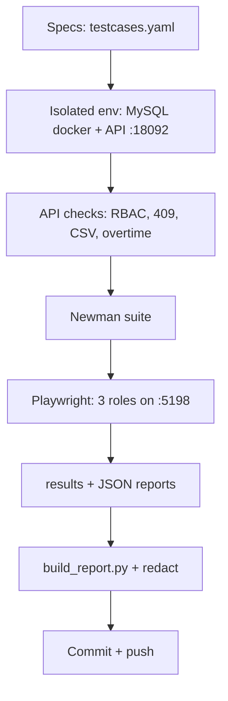

# shiftbase-qa

QA portfolio untuk Shiftbase — test plan, 38 test cases, 2 bug report
(semua Fixed), Newman API suite, Playwright e2e 3 peran, laporan Excel.

## Purpose, Output & Expectations

**Purpose.** A multi-role HR system (admin/manager/staff) fails silently when
permissions are wrong — the most dangerous bugs are the ones that return 200
to the wrong eyes. This repo proves the RBAC matrix and business rules with
evidence.

**Output.** A test plan, 38 test cases (100% executed), 2 real UX bugs (both
fixed with Playwright proof), a 15-assertion Newman suite, 8 Playwright tests
across 3 roles, and a 5-sheet Excel report.

**Expectations.** After reading: the full RBAC matrix is covered
(allow + deny per role), shift conflicts (409), CSV import rules, and overtime
math are all proven; every bug links to its fix.

## Features

| Feature | Description |
|---|---|
| Test plan | - Scope (4 pages × 3 roles + API), MySQL docker env, entry/exit criteria, risks (one check-in per day, shared-day state). - Purpose: bound the matrix before testing. Output: agreed gates. |
| RBAC matrix tests | - Allow/deny per role per endpoint group (employees, shifts, reports, import, own-vs-managed attendance). - Purpose: catch wrong-eyes bugs. Output: 403/200 matrix proven. |
| Business-rule tests | - Shift overlap 409, CSV header/row/2MB rules, overtime `GREATEST(hours-8,0)`, coverage headcount. - Purpose: rules, not just CRUD. Output: boundary behavior proven. |
| Bug reports | - 2 real UX bugs (stale dropdown after import, tab not persisted) with repro + fix + e2e proof. - Purpose: findings closed, not filed. Output: Fixed. |
| Newman + Playwright | - API suite 15/15; e2e 8/8 incl. bugfix proof specs. - Purpose: regression + human proof. Output: green runs. |
| Excel report | - Generated 5-sheet report with COUNTIF summary. - Purpose: readable evidence. Output: `Shiftbase-QA-Report.xlsx`. |

## How It Works



## Hasil (run 2026-09-15, env terisolasi)

| Suite | Hasil |
|---|---|
| Test cases | 38/38 Pass |
| Newman API (`shiftbase` collection) | 15/15 assertions |
| Playwright e2e (Chromium headless) | 8/8 |
| `go test` + swagger validate | Pass, service 79.8% |
| Bug terbuka | 0 (2 Fixed) |

Fokus: matriks RBAC admin/manager/staff, konflik shift 409, import CSV
(header/aturan/2MB), overtime >8 jam, roster per peran.

Laporan utama: [`reports/Shiftbase-QA-Report.xlsx`](reports/Shiftbase-QA-Report.xlsx)
(generate via `tools/build_report.py`, jangan edit manual).

## Struktur

```
test-plan.md, data/testcases.yaml, data/bugs.yaml, data/results.yaml
tools/build_report.py, tools/redact_reports.py
e2e/ (Playwright: web.spec.ts, web2.spec.ts)
reports/ (newman.json, playwright.json, XLSX)
```

## Cara run (urutan penting — isolasi!)

```bash
# 1. MySQL docker + migrate + seed (DB shiftbase_qa)
docker run --rm --name sb-qa-mysql -e MYSQL_ROOT_PASSWORD=rootpass \
  -e MYSQL_DATABASE=shiftbase_qa -e MYSQL_USER=shift -e MYSQL_PASSWORD=shiftpass \
  -p 13306:3306 mysql:8.4 &
goose -dir ../shiftbase/migrations mysql \
  "shift:shiftpass@tcp(127.0.0.1:13306)/shiftbase_qa?parseTime=true" up
# seed via mysql client di container

# 2. API :18092, 3. API checks, 4. Newman, 5. e2e (:5198)
PORT=18092 JWT_SECRET=x DB_DSN="shift:shiftpass@tcp(127.0.0.1:13306)/shiftbase_qa?parseTime=true" /tmp/sb-qa &
python3 /tmp/sb_run.py   # → data/results.yaml (ad-hoc)
npx newman run ../shiftbase/api/postman_collection.json --env-var baseUrl=http://localhost:18092
cp e2e/.env.example e2e/.env  # isi SB_PASS_*
cd e2e && npx playwright test

# 6. Generate + sanitasi
python3 tools/build_report.py && python3 tools/redact_reports.py
```

## Bug temuan (ringkas)

* BUG-SB-001 (Low): dropdown pegawai tak refresh setelah import CSV.
* BUG-SB-002 (Low): tab aktif tak persist setelah reload (tanpa router).

## Hygiene

Kredensial seed (`*@shiftbase.local`) adalah akun demo fiktif (publik by design).
Password e2e via env (`SB_PASS_*`); reports selalu lewat `redact_reports.py`.
